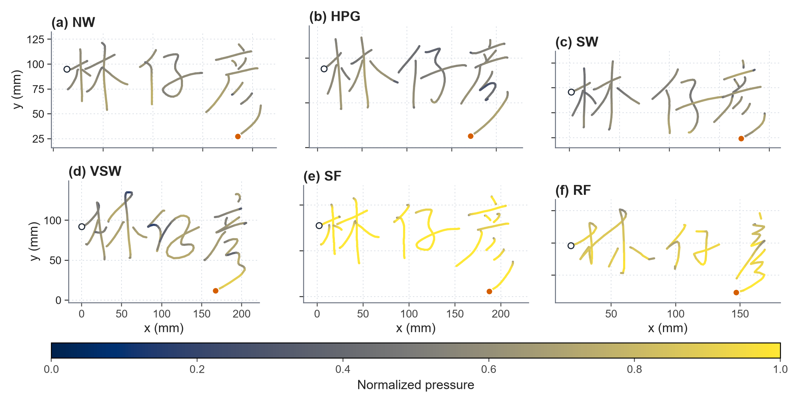
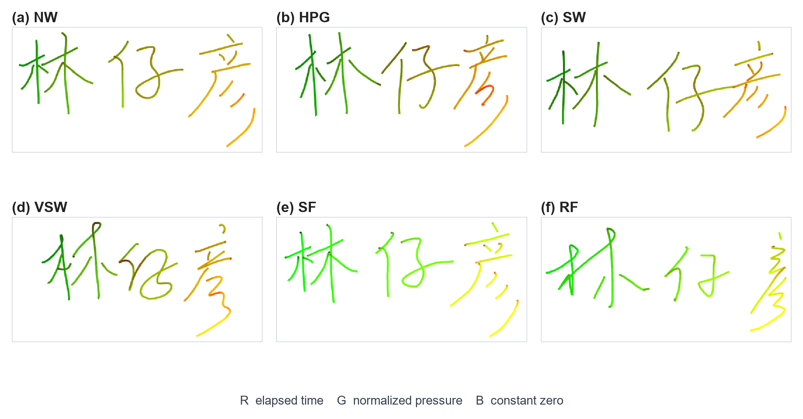

# SigVTA

SigVTA is an online signature dataset and benchmark for **verification** and **open-set template attribution**. It records genuine signatures under controlled writing conditions together with random and skilled forgeries, and it keeps the link between each skilled forgery and the specific genuine signature the forger was shown.

The full dataset contains 79 target writers and 7,900 signatures. This repository publishes a sample from one writer so that the format can be inspected without an application. The full release is available on request for academic use.

## Repository contents

```text
sample/writer080/
├── NW/   normal writing            20 files
├── SW/   standing writing           20 files
├── HPG/  high pen grip              20 files
├── VSW/  variable-speed writing     20 files
├── RF/   random forgery             12 files
├── SF/   skilled forgery             8 files
└── manifest.json
```

Writer `080` was chosen as the public sample. The sample is de-identified: it contains pen trajectories and acquisition metadata only, with no name, contact detail, or identity mapping.

The two figures below show one signature from each of the six states, rendered from the CSV in this repository. Line color in the first encodes normalized pressure; the second is the deterministic RGB encoding used in the paper (relative time in R, normalized pressure in G, B fixed at zero).





## File format

Each signature is a UTF-8 CSV with seven columns:

| Column | Content | Unit |
| --- | --- | --- |
| 1 | time | ms |
| 2 | X coordinate | mm |
| 3 | Y coordinate | mm |
| 4 | pressure, normalized to [0, 1] | — |
| 5 | derived speed | mm/s |
| 6 | derived direction angle | degrees |
| 7 | pen state: 1 pen-down, 0 pen-up | — |

The nominal sampling interval is 10 ms. `manifest.json` is the index for this sample: it gives each file's label, state, forger, the skilled-forgery reference, row count, duration, and SHA-256.

## Acquisition

Genuine signatures were collected under four controlled conditions (NW, SW, HPG, VSW), in two sessions at least three days apart, ten signatures per condition per session. Forgeries were produced by four forgers who do not overlap with the target writers. A random forgery was written from the target name alone, before the forger had seen any target signature. A skilled forgery was produced while viewing one assigned normal-writing signature, and that assignment is recorded per file.

## Access to the full dataset

The full dataset is distributed under a restricted academic-use agreement. It is not in this repository.

To request it:

1. Complete the request form: [ACCESS_REQUEST.md](ACCESS_REQUEST.md), and send the filled form to 2846512082@qq.com
2. Or write to 2846512082@qq.com directly with the same information

Please include your name, affiliation, and intended use. Access is granted for non-commercial academic research. Recipients agree not to redistribute the data and not to attempt to re-identify participants. Approved requests receive a time-limited download link.

## Citation

If you use SigVTA, please cite:

```bibtex
@article{sigvta2026,
  title   = {SigVTA: An Online Signature Dataset and Benchmark for Verification and Open-Set Template Attribution},
  author  = {},
  journal = {},
  year    = {2026},
  note    = {Under review}
}
```

## License

The sample in this repository is released for academic research under the terms in [LICENSE](LICENSE). The full dataset is not covered by this file and is supplied separately under its own agreement.
